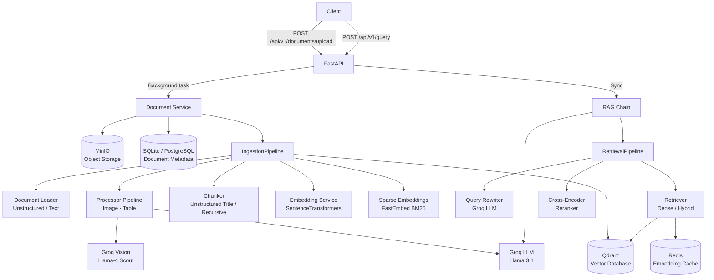

# OmniRAG

A production-ready Retrieval-Augmented Generation (RAG) backend that ingests documents, builds a searchable knowledge base, and answers natural language questions grounded strictly in the provided content.

OmniRAG handles the full pipeline — from raw file upload through multimodal enrichment, hybrid vector indexing, cross-encoder reranking, and LLM-powered answer generation — with a clean async FastAPI interface.

---

## Features

### Document Ingestion

- Upload PDF, DOCX, PPTX, TXT, and Markdown files via REST API
- SHA-256 content hashing with automatic deduplication on re-upload
- Asynchronous background processing so uploads return immediately
- Full lifecycle tracking: `uploaded → processing → ready / failed`
- Immutable event log capturing each stage of the ingestion pipeline

### Multimodal Enrichment

- **Image understanding**: extracted images are described by a vision LLM (Groq/Llama-4 Scout) and the description is appended to the chunk text, making visual content searchable
- **Table enrichment**: HTML tables are summarised by an LLM and the summary is merged with the raw table content for richer retrieval

### Chunking

- Automatic strategy selection per document type:
  - **Structure-aware chunking** (`UnstructuredTitleChunker`) for structured formats that preserve headings, tables, and page layout
  - **Recursive character chunking** (`RecursiveChunker`, via LangChain) as the fallback for plain text and Markdown

### Retrieval

- **Dense retrieval**: cosine similarity search using sentence-transformer embeddings (BAAI/bge-small-en-v1.5 by default)
- **Hybrid retrieval**: dense semantic search fused with BM25 sparse search via Reciprocal Rank Fusion (RRF), selectable at runtime
- **Query rewriting**: the user's question is expanded and clarified by the LLM before retrieval
- **Cross-encoder reranking**: retrieved candidates are reranked using `cross-encoder/ms-marco-MiniLM-L-6-v2` before being sent to the LLM

### Generation

- LLM answers are grounded strictly in retrieved context (no hallucination outside provided documents)
- Response includes cited source chunks with vector scores and rerank scores
- Token usage and end-to-end latency are returned in every response

### Infrastructure

- Redis-backed embedding cache — avoids re-embedding identical texts on repeated queries
- MinIO object storage for persisted raw document files
- Qdrant vector database with named dense + sparse vector collections
- SQLite (default) or PostgreSQL for relational document metadata (asyncpg / aiosqlite)
- Per-request UUID tracing via `X-Request-ID` response header
- Structured JSON logs with rotation, retention, and compression (Loguru)
- Exponential backoff with jitter on all Groq API calls

---

## Architecture Overview



**Upload flow**: `Client → API → DocumentService → [MinIO, RelDB] → IngestionPipeline → [Loader → Processors → Chunker → Embedder → Qdrant]`

**Query flow**: `Client → API → RAGChain → [QueryRewriter → Retriever → Reranker] → LLM → Response`

---

## Tech Stack

| Category                 | Technology                                                 |
| ------------------------ | ---------------------------------------------------------- |
| **API Framework**        | FastAPI + Uvicorn                                          |
| **Language**             | Python 3.12                                                |
| **Package Manager**      | uv                                                         |
| **Relational DB**        | SQLite (aiosqlite) · PostgreSQL (asyncpg) via SQLAlchemy 2 |
| **Vector DB**            | Qdrant                                                     |
| **Object Storage**       | MinIO                                                      |
| **Cache**                | Redis 7                                                    |
| **LLM Provider**         | Groq (Llama 3.1 · Llama-4 Scout)                           |
| **Embeddings**           | SentenceTransformers (BAAI/bge-small-en-v1.5)              |
| **Sparse Embeddings**    | FastEmbed (Qdrant/bm25)                                    |
| **Reranker**             | SentenceTransformers CrossEncoder (ms-marco-MiniLM-L-6-v2) |
| **Document Parsing**     | Unstructured (`hi_res` strategy)                           |
| **Text Splitting**       | LangChain Text Splitters                                   |
| **Logging**              | Loguru                                                     |
| **Validation**           | Pydantic v2 / pydantic-settings                            |
| **Linting / Formatting** | Ruff                                                       |
| **Type Checking**        | mypy                                                       |
| **Testing**              | pytest + pytest-asyncio                                    |
| **Containerisation**     | Docker + Docker Compose                                    |

---

## Repository Structure

```
OmniRAG/
├── backend/                    # Entire application (single service)
│   ├── app/
│   │   ├── ai/                 # AI service abstractions and providers
│   │   │   ├── embeddings/     # Dense embedding service + SentenceTransformers provider
│   │   │   ├── llm/            # LLM abstraction + Groq provider
│   │   │   ├── reranker/       # Cross-encoder reranking service
│   │   │   ├── sparse/         # Sparse embedding service + FastEmbed/BM25 provider
│   │   │   ├── vision/         # Vision LLM service + Groq vision provider
│   │   │   └── prompts/        # All system and user prompts
│   │   ├── api/v1/endpoints/   # FastAPI route handlers (documents, query)
│   │   ├── cache/              # Redis cache wrappers + embedding cache
│   │   ├── core/               # Config, logging, Redis client, exceptions
│   │   ├── middleware/         # Request ID tracing + latency logging
│   │   ├── models/             # SQLAlchemy ORM models (Document, DocumentEvent)
│   │   ├── rag/
│   │   │   ├── chain/          # End-to-end RAG orchestration
│   │   │   ├── chunking/       # Chunking strategies (recursive, unstructured-title)
│   │   │   ├── ingestion/      # Ingestion pipeline + domain models
│   │   │   ├── loaders/        # Document loaders (Unstructured, plain text)
│   │   │   ├── processors/     # Image + table enrichment processors
│   │   │   ├── query/          # Query rewriting service
│   │   │   └── retrieval/      # Retrieval pipeline, retrievers, context builder
│   │   ├── repositories/       # Data access layer (DocumentRepository, EventRepository)
│   │   ├── schemas/            # Pydantic API request/response schemas
│   │   ├── services/           # Business logic layer (DocumentService)
│   │   ├── storage/
│   │   │   ├── database/       # SQLAlchemy engine, session, schema init
│   │   │   ├── object/         # MinIO object storage abstraction
│   │   │   └── vector/         # Qdrant vector store abstraction
│   │   ├── tasks/              # FastAPI background task wrappers
│   │   ├── utils/              # Shared utilities (retry, concurrency, batching, hashing)
│   │   └── main.py             # Application entry point, lifespan, middleware
│   ├── pyproject.toml          # Dependencies and tooling config
│   ├── Dockerfile
│   └── .env.example
├── docker-compose.yml          # Redis, Qdrant, MinIO services
└── Makefile                    # Developer task shortcuts
```

---

## Getting Started

### Prerequisites

- Python 3.12
- [uv](https://docs.astral.sh/uv/) package manager
- Docker + Docker Compose (for infrastructure services)
- A [Groq API key](https://console.groq.com/)

### 1. Clone the repository

```bash
git clone https://github.com/your-org/omnirag.git
cd omnirag
```

### 2. Start infrastructure services

```bash
make infra
# Starts Redis (6379), Qdrant (6333), and MinIO (9000/9001)
```

### 3. Install backend dependencies

```bash
make install
# Equivalent to: cd backend && uv sync
```

### 4. Configure environment

```bash
cp backend/.env.example backend/.env
```

Edit `backend/.env` and set at minimum:

```dotenv
GROQ_API_KEY=your_groq_api_key_here
```

All other values have working defaults for local development.

### 5. Run the backend

```bash
make backend
# Equivalent to: cd backend && uv run uvicorn app.main:app --reload
```

The API is now available at `http://localhost:8000`.

Interactive API docs: `http://localhost:8000/docs`

---

## Environment Variables

| Variable                     | Default                                     | Description                                                                        |
| ---------------------------- | ------------------------------------------- | ---------------------------------------------------------------------------------- |
| `PROJECT_NAME`               | `OmniRAG`                                   | Application name                                                                   |
| `API_VERSION`                | `v1`                                        | API version string                                                                 |
| `ENVIRONMENT`                | `development`                               | `development` · `staging` · `production`                                           |
| `LOG_LEVEL`                  | `INFO`                                      | `DEBUG` · `INFO` · `WARNING` · `ERROR`                                             |
| `REDIS_HOST`                 | `localhost`                                 | Redis hostname                                                                     |
| `REDIS_PORT`                 | `6379`                                      | Redis port                                                                         |
| `REDIS_PASSWORD`             | _(none)_                                    | Redis password (optional)                                                          |
| `REDIS_DB`                   | `0`                                         | Redis database index                                                               |
| `QDRANT_HOST`                | `localhost`                                 | Qdrant hostname                                                                    |
| `QDRANT_PORT`                | `6333`                                      | Qdrant gRPC/HTTP port                                                              |
| `QDRANT_COLLECTION`          | `omnirag_chunks`                            | Qdrant collection name                                                             |
| `VECTOR_UPSERT_BATCH_SIZE`   | `256`                                       | Vectors upserted per Qdrant batch                                                  |
| `EMBEDDING_MODEL`            | `BAAI/bge-small-en-v1.5`                    | SentenceTransformers model                                                         |
| `EMBEDDING_DIMENSION`        | `384`                                       | Must match the chosen embedding model                                              |
| `EMBEDDING_BATCH_SIZE`       | `64`                                        | Texts embedded per batch                                                           |
| `SPARSE_EMBEDDING_PROVIDER`  | `fastembed`                                 | Sparse embedding backend                                                           |
| `SPARSE_EMBEDDING_MODEL`     | `Qdrant/bm25`                               | FastEmbed model for BM25                                                           |
| `GROQ_API_KEY`               | **required**                                | Groq API key                                                                       |
| `GROQ_MODEL`                 | `llama-3.1-8b-instant`                      | Groq chat/completion model                                                         |
| `GROQ_VISION_MODEL`          | `meta-llama/llama-4-scout-17b-16e-instruct` | Groq vision model for image analysis                                               |
| `MAX_CONCURRENT_AI_REQUESTS` | `5`                                         | Semaphore limit for parallel AI calls                                              |
| `AI_MAX_RETRIES`             | `5`                                         | Retry attempts for Groq API failures                                               |
| `AI_RETRY_BASE_DELAY`        | `2`                                         | Base delay (seconds) for exponential backoff                                       |
| `RETRIEVAL_TOP_K`            | `20`                                        | Candidates retrieved before reranking                                              |
| `RETRIEVAL_MODE`             | `dense`                                     | `dense` or `hybrid`                                                                |
| `RERANK_TOP_K`               | `5`                                         | Top chunks passed to the LLM after reranking                                       |
| `RERANKER_MODEL`             | `cross-encoder/ms-marco-MiniLM-L-6-v2`      | CrossEncoder model                                                                 |
| `MIN_RELEVANCE_SCORE`        | `0.3`                                       | Minimum reranker score threshold (defined, not yet enforced in retrieval pipeline) |
| `DATABASE_URL`               | `sqlite+aiosqlite:///./omnirag.db`          | SQLAlchemy async database URL                                                      |
| `MINIO_ENDPOINT`             | `localhost:9000`                            | MinIO endpoint                                                                     |
| `MINIO_ACCESS_KEY`           | `minioadmin`                                | MinIO access key                                                                   |
| `MINIO_SECRET_KEY`           | `minioadmin`                                | MinIO secret key                                                                   |
| `MINIO_BUCKET`               | `documents`                                 | MinIO bucket name                                                                  |
| `MINIO_SECURE`               | `false`                                     | Enable TLS for MinIO                                                               |

---

## API Overview

Base path: `/api/v1`

### Documents

| Method | Path                | Description                                        |
| ------ | ------------------- | -------------------------------------------------- |
| `POST` | `/documents/upload` | Upload a document and trigger background ingestion |

**Upload response** includes the document ID, status, and chunk/element counts. Uploading an identical file (same SHA-256 hash) returns the existing document record without reprocessing.

**Supported file types:** `.pdf`, `.docx`, `.pptx`, `.txt`, `.md`

### Query

| Method | Path      | Description                                   |
| ------ | --------- | --------------------------------------------- |
| `POST` | `/query/` | Ask a question against all ingested documents |

**Request body:**

```json
{ "question": "What does the architecture diagram show?" }
```

**Response** includes the generated answer, source chunks with vector and rerank scores, token usage, model name, and end-to-end latency in milliseconds.

### Health

| Method | Path      | Description                                                     |
| ------ | --------- | --------------------------------------------------------------- |
| `GET`  | `/health` | Service health check (Redis connectivity, version, environment) |

---

## Development

### Available `make` targets

| Command        | Description                                         |
| -------------- | --------------------------------------------------- |
| `make install` | Install backend dependencies with uv                |
| `make backend` | Start the development server with hot-reload        |
| `make infra`   | Start Redis, Qdrant, and MinIO via Docker Compose   |
| `make test`    | Run the test suite                                  |
| `make lint`    | Run Ruff linter                                     |
| `make format`  | Run Ruff formatter                                  |
| `make type`    | Run mypy type checker                               |
| `make quality` | Run format, lint, type check, and tests in sequence |

### Logging

Logs are written to both `stdout` (colourised) and `logs/omnirag.log` (JSON, 10 MB rotation, 7-day retention, gzip compression).

---
